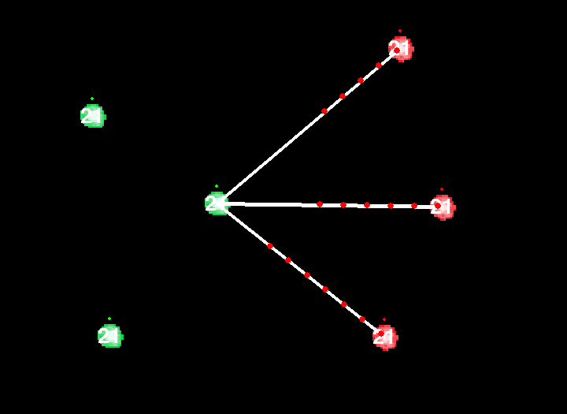

# Cell expansion 

The game made in pygame inspired by Cell Expansion Wars

## The game

### In the main menu:
- play - open the submenu to choose to play single or multiplayer
- editor - open the ditor
- X - load game saved in the save.xml file
- L - load game saved in the save.json file

### Game modes:
- Single - singleplayer against the enemy - AI made as calculating minimum of the cost function
- Local - host the game locally
- Multi - join the game hosted by someone else - type address of the host like the pattern 192.168.8.1/24:5555 than click Multi button

### In the single game:
- press X to save the current game state in the xml format (save.xml)
- press S to save the current game state in the json format (save.json)

## How to play

Your goal in this game is to take all of enemy's cells and not allow him to this with yours
Click the cell to activate then click other cell - yours or enemy's to make the connection between them
As the connection is established first cell start to send "bullets" which are damaging enemies and healing friends
You can destroy connection by clicking on it
As this program is made due to educational purposes (practice in object oriented programming, delaing with data containing files, communication by tcp/ip etc. ) you can also partially control the enemies cells
